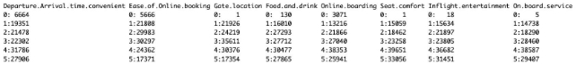

Relazione progetto Machine Learning

Passengers Satisfaction 

Sommario 

***Descrizione del dominio di riferimento e obiettivi.............................................................. 2 Scelte di design per la creazione del dataset, ipotesi e assunzioni ..................................... 4* Scelte di design ......................................................................................................................... 4 Ipotesi e assunzioni ................................................................................................................... 4 *Analisi esplorativa ............................................................................................................ 5* Principal Components Analysis ............................................................................................... 11 Conclusioni ............................................................................................................................. 14 *Descrizione e motivazione dei modelli scelti .................................................................... 15* Naive Bayes ............................................................................................................................ 15 Decision Tree .......................................................................................................................... 15** 

***Analisi dei risultati ottenuti............................................................................................. 17* Naive Bayes ............................................................................................................................ 17 Decision Tree .......................................................................................................................... 19 *Conclusioni ..................................................................................................................... 22*** 

Descrizione del dominio di riferimento e obiettivi 

Il  dataset  scelto  (Passengers  Satisfaction[^1])  contiene  dati  riguardanti  un’indagine  sulla soddisfazione dei passeggeri di una compagnia aerea. L’obiettivo è determinare quali fattori sono altamente correlati a un passeggero soddisfatto e determinare la soddisfazione dei passeggeri in base a questi fattori.  

Il dataset contiene i seguenti valori: 

|Variabile |Descrizione |
| - | - |
|*X* |Indice di riga |
|*ID* |Identificativo del passeggero.  |
|*Gender* |Sesso dei passeggeri (Female, Male) |
|*Customer Type* |Tipo di cliente (Loyal customer, Disloyal customer) |
|*Age* |Età effettiva dei passeggeri |
|*Type of Travel* |Scopo  del  volo  dei  passeggeri  (viaggio  personale, viaggio d'affari) |
|*Class* |Classe di viaggio nell'aereo dei passeggeri (Business, Eco, Eco Plus) |
|*Flight distance* |Distanza di volo di questo viaggio |
|*Inflight wifi service* |Livello di soddisfazione del servizio Wi-Fi in volo  (0:Valutazione non data;1-5) |
|*Departure/Arrival  time convenient* |
Livello  di  soddisfazione  dell'orario  di  partenza/arrivo conveniente 

(0:Valutazione non data;1-5) 
|
|*Ease of Online booking* |Livello di soddisfazione della prenotazione online (0:Valutazione non data;1-5) |
|*Gate location* |Livello di soddisfazione della posizione del Gate (0:Valutazione non data;1-5) |
|*Food and drink* |Livello di soddisfazione di cibi e bevande (0:Valutazione non data;1-5) |
|*Online boarding* |livello di soddisfazione dell'imbarco online (0:Valutazione non data;1-5) |
|*Seat comfort* |Livello di soddisfazione del comfort del sedile |
||(0:Valutazione non data;1-5) |
| :- | - |
|*Inflight entertainment* |livello di soddisfazione dell'intrattenimento in volo (0:Valutazione non data;1-5) |
|*On-board service* |Grado di soddisfazione del servizio a bordo (0:Valutazione non data;1-5) |
|*Leg room service* |Livello di soddisfazione dello spazio per le gambe. (0:Valutazione non data;1-5) |
|*Baggage handling* |Livello di soddisfazione della gestione dei bagagli (0:Valutazione non data;1-5) |
|*Check-in service* |Grado di soddisfazione del servizio di check-in (0:Valutazione non data;1-5) |
|*Inflight service* |Livello di soddisfazione del servizio a bordo (0:Valutazione non data;1-5) |
|*Cleanliness* |Livello di soddisfazione della pulizia (0:Valutazione non data;1-5) |
|*Departure Delay in Minutes* |minuti di ritardo alla partenza |
|*Arrival Delay in Minutes* |minuti di ritardo all'arrivo |
|*Satisfaction* |livello di soddisfazione della compagnia aerea (soddisfazione, neutralità o insoddisfazione) |

Il dataset viene fornito già suddiviso in train set e test set con una divisione 80:20 per un totale di 129880 elementi in 25 variabili.  

Scelte di design per la creazione del dataset, ipotesi e assunzioni 

Durante questa fase dell’analisi, è stato analizzate il dataset così come è stato fornito e sono state prese scelte di design, ovvero come modellare il dataset in modo tale di avere le variabili nel formato corretto e poterle utilizzare al meglio, e sono state fatte delle assunzioni e ipotesi sui dati in modo da dare una prima interpretazione.  

Scelte di design 

Una delle prime operazioni fatte è quella di aver unito training set e test set in modo di effettuare l’analisi non soltanto su porzioni del dataset, ma su tutti i dati forniti.  

Le variabili nel dataset sono di tipo numerico o in formato stringa. In particolare, si può osservare che le variabili di tipo stringa sono variabili che di fatto rappresentano delle categorie (*Gender, Customer type, Type of Travel, Class, Satisfaction*). Per questo motivo, una delle prime operazioni fatte è stata quella di trasformare queste variabili in variabili categoriche, ovvero di tipo *factor*. 

Prima di effettuare qualsiasi tipo di analisi, è stata presa la decisione di eliminare le variabili X e ID, variabili non significative per effettuare la classificazione dato che rappresentano rispettivamente il numero di riga e l’identificativo del passeggero. Si può assumere che l’identificativo non faccia variare la possibilità che un passeggero al termine di un viaggio sia soddisfatto oppure no, lo stesso, logicamente per le righe del dataset.  

Un ulteriore modifica apportata al dataset riguarda tutte quelle variabili che rappresentano una valutazione. È stata presa la decisione di trasformare queste variabili in variabili ordinali. Questa tipologia di variabile specifica che il valore appartiene ad un dato dominio, in questo caso da 0 a 5, in modo simile alle variabili categoriche, ma permette di mantenere un ordinamento fra i valori in modo da rappresentare al meglio la valutazione del servizio fornito dalla compagnia aerea. In questo modo il valore 5 viene interpretato come un valore maggiore di 4 e perciò rappresenta un valore piú significativo. 

Ipotesi e assunzioni 

Osservando il dataset si possono fare una serie di ipotesi e assunzioni sul legame che ci può essere tra le diverse variabili.  

Si può assumere che se le valutazioni dei vari servizi forniti dalla compagnia sono piú alti, molto probabilmente il passeggero sarà soddisfatto. Allo stesso modo, ci si aspetta che un passeggero in business class è piú probabile che dia valutazioni migliori sui servizi che la business class garantisce, come *“Seat comfort”,* *“Food and Drink”,* *“On board services”,* … Si può ipotizzare, però, che ci siano dei servizi forniti dalla compagnia che risultino piú rilevanti nel determinare se un passeggero è soddisfatto oppure no. Ad esempio, si può pensare che se un passeggero ha fatto fatica a prenotare il proprio biglietto di volo, sia insoddisfatto, oppure se un passeggero ha valutato positivamente l’intrattenimento a bordo, sia soddisfatto.  

Analisi esplorativa 

Si tratta di un processo di indagine preliminare dei dati al fine di scoprire, comprendere e ottenere informazioni significative dal dataset. L'obiettivo dell'analisi esplorativa è quello di rivelare modelli, tendenze, relazioni e anomalie nei dati, fornendo una panoramica approfondita e intuitiva del dataset. 

Come prima operazione è stata eseguito il comando summary() che fornisce i risultati delle principali operazioni di statistica descrittiva per tutte le variabili presenti nel mio dataset. 

Si può osservare che il seguente comando fornisce misure come il massimo, il minimo, la media, la mediana, ecc… per tutte le variabili discrete che nel mio dataset sono soltanto 4, mentre conta il numero il numero di volte che è stato trovato un determinato valore per le variabili categoriche. 

La seconda operazione eseguita è un barplot che permettesse di comprendere quanti passeggeri soddisfatti e quanti passeggeri non soddisfatti sono presenti nel dataset.  

Si può osservare che i passeggeri neutrali o non soddisfatti sono in quantità maggiore rispetto ai passeggeri soddisfatti, ma la differenza non è elevatissima. Si può affermare che il dataset è piú o meno bilanciato.  

È stato svolta un’analisi per la ricerca dei valori nulli 

Come si può osservare dal grafico, il dataset non contiene valori nulli tranne per la variabile “Arrival.Delay.in.Minutes” che contiene circa lo 0, 3% dei dati nulli, di preciso 393. Data la bassa numerosità di valori nulli e la grande mole di dati da cui è composto il dataset, è stata presa la decisione di eliminare direttamente le righe. 

Nei grafici successivi è stata fatta un’analisi sulla correlazione presente fra le diverse variabili numeriche, in modo da determinare se le diverse coppie sono altamente correlate oppure no. 

In particolare, nelle immagini sono riportate due matrici di correlazione, la prima che mostra semplicemente tramite i colori, la correlazione fra le variabili, e la seconda che mostra anche la distribuzione di ogni coppia.  

Dai seguenti grafici si può osservare che le variabili numeriche del mio dataset non sono correlate, a parte per le variabili “Departure.Delay.in.Minutes” e “Arrival.Delay.in.Minutes”. La spiegazione della correlazione fra queste due variabili ha una spiegazione logica. Infatti, un volo che parte in ritardo è molto probabile che arrivi in ritardo. 

Un’analisi piú nel dettaglio di queste variabili viene mostrata nelle immagini seguenti, dove sono state messe a confronto le variabili numeriche rispetto alla classe target.  

I primi due grafici sono dei box plot, un tipo di grafico che mostra la distribuzione di una variabile numerica attraverso cinque statistiche descrittive: mediana, quartili, minimo e massimo. Questo tipo di grafico è utile per visualizzare la variabilità, la simmetria e la presenza di eventuali valori anomali di una determinata variabile. Se per la variabile “Age”, sembrano non esserci correlazioni significative con la classe target, nel caso della variabile “Flight Distance” si può osservare che i passeggeri che risultano soddisfatti della compagnia aerea effettuano viaggio tendenzialmente piú lunghi, mentre i passeggeri che sono neutrali 

- non soddisfatti effettuano mediamente viaggi brevi.  

Gli ultimi due grafici a destra mostrano la relazione di minuti di ritardo di partenza e arrivo rispetto alla classe target. I due grafici sono in linea con le osservazioni di correlazione fatte in precedenza, infatti sono molto simili. Non sembrano esserci legami significativi con la classe target.  

I successivi grafici mostrano invece le relazioni presenti fra le diverse variabili categoriche e ordinali rispetto alla classe target. 

Dai seguenti grafici si può osservare che certi servizi, quando viene attribuito un valore basso, tendenzialmente è stato dato da passeggeri che sono risultati insoddisfatti o neutrali. Al contrario, in certi casi, voti alti corrispondono a passeggeri soddisfatti. Dei casi evidenti sono nel caso delle variabili “Inflight Wifi Service”, “Online Boarding”, “Easy Online Booking”. Si può supporre che questi servizi sia importanti per la classificazione dei passeggeri dato che è evidente la separazione delle due classi. 

Questi grafici mostrano le restanti variabili non ancora analizzate. Le osservazioni sono le medesime del primo gruppo. I passeggeri soddisfatti tendenzialmente sono quelli che danno valutazioni piú alte, mentre quelli che danno le valutazioni piú basse sono quelli che si classificano come neutrali o insoddisfatti.  

Di seguito invece viene riportata l’analisi esplorativa delle variabili categoriche presenti nel dataset. 

Il primo grafico rappresenta la variabile “Gender” che è bilanciata, sia rispetto alla quantità di passeggeri maschi e femmine, sia rispetto alla quantità di passeggeri soddisfatti e non soddisfatti. Dal secondo grafico si possono osservare i tipi di clienti rispetto alla classe target. Si osserva che “Loyal Customer” è in grande quantità rispetto a “Disloyal Customer”. Questa permette di capire che nel dataset sono presenti quasi soltanto “Loyal Customer”. Dal terzo grafico si può osservare come ci siano molti passeggeri che effettuano un viaggio per motivi lavoriti che tendono ad essere soddisfatti, in confronto ai passeggeri che effettuano un viaggio per motivi personali, che tendono ad essere insoddisfatti o neutrali. Infine, l’ultimo grafico mostra la soddisfazione di un passeggero rispetto alla classe del proprio posto a sedere. Si osserva che tendenzialmente chi viaggia in economi è insoddisfatto o neutrale del servizio, al contrario di chi viaggia in business class che risulta essere tendenzialmente soddisfatto. Si osserva inoltre che coloro che viaggiano in eco plus sono in quantità molto ridotta rispetto alle altre due classi, ma sempre con una prevalenza di passeggeri insoddisfatti o neutrali.  

Si possono fare una serie di ipotesi e considerazioni finali al termine dell’analisi esplorativa. Tendenzialmente le variabili che esprimono una valutazione, mostrano che chi da una valutazione piú bassa risulta essere un passeggero neutrale o insoddisfatto. A seguito dell’analisi delle variabili categoriche si può dedure che la maggior parte dei passeggeri che risultano essere neutrali o insoddisfatti sono coloro che viaggiano per motivi personali e che hanno acquistato un biglietto in eco o eco plus class.  

Dall’analisi esplorativa si può ipotizzare che tendenzialmente chi viaggia in business class sono coloro che effettuano viaggi lunghi per motivi di lavoro indipendentemente dal genere. Inoltre, hanno mediamente un’età maggiore rispetto ai passeggeri che risultano insoddisfatti 

- neutrali. 

Principal Components Analysis 

L’analisi delle componenti principali (PCA) ci consente di riassumere e visualizzare le informazioni in un set di dati contenente osservazioni descritte da piú variabili discrete correlate. L’analisi delle componenti principali viene utilizzata per estrarre le informazioni importanti da una tabella di dati multivariata e per esprimere queste informazioni come un insieme di poche nuove variabili chiamate componenti principali. Queste nuove variabili corrispondono a una combinazione lineare delle originali. L’obiettivo è identificare le direzioni lungo le quali la variazione dei dati è massima. 

L’analisi della PCA è stata fatta soltanto sulle variabili numeriche, poiché le variabili categoriche non possono essere utilizzate nella PCA in quanto non possono essere rappresentati come valori numerici continui, necessari per calcolare le distanze e le correlazioni tra le variabili. La scelta di utilizzare questa analisi è stata fatta per confermare le assunzioni fatte durante l’analisi esplorativa e per verificare se ci sono ulteriori correlazioni fra le variabili.  

Come primo passo sono stati calcolati gli autovalori che misurano la quantitá di variazione trattenuta da ciascuna componente principale. Gli autovalori sono importanti per capire quanto una componente principale influenza la variazione nel set di dati. 

Il numero di componenti principali è uguale al numero di variabili analizzate dalla PCA. Si nota che le prime 3 componenti principali coprono il 99% della variazione dei dati, mentre le prime 2 componenti coprono il 76%, il che potrebbe essere sufficiente. 

Il seguente grafico mostra visivamente come le diverse dimensioni contribuiscono alla variazione dei dati nel dataset.  

Dopo aver calcolato gli autovalori e la varianza di ogni dimensione, esamino il contributo di rappresentazione delle variabili rispetto alle diverse dimensioni.  

Si può osservare che la dimensione 1 rappresenta perfettamente le variabili “*Departure.Delay.in.Minutes”* e “*Arrival.Delay.in.Minutes”*, mentre la dimensione 2 e 3 rappresentano bene le variabili “*Age*” e “*Flight Distance*”.  

Il seguente grafico mostra il cerchio di correlazione rispetto alle prime due dimensioni, con i colori che invece rappresentano la qualità di rappresentazione *cos2.* 

Successivamente è stata eseguita un’analisi sul contributo delle diverse variabili rispetto alle componenti principali.  

Si può osservare che “*Age*” e “*Flight Distance*” contribuiscono unicamente alla rappresentazione delle dimensioni 2 e 3, mentre “*Departure.Delay.in.Minutes”* e “*Arrival.Delay.in.Minutes”* contribuisco alla rappresentazione delle dimensioni 1 e 4. 

Il seguente grafico mostra il cerchio di correlazione rispetto alle prime due dimensioni, con i colori che invece rappresentano il valore del contributo delle variabili*.* 

Dall’analisi delle componenti principali si osserva come esiste una forte correlazione fra le “*Departure.Delay.in.Minutes”* e “*Arrival.Delay.in.Minutes”* e fra le variabili “*Age*” e “*Flight Distance*”.  

Conclusioni 

Alla luce dei risultati dell’analisi esplorativa, è stato ritenuto opportuno rimuovere alcune variabili dal dataset per cercare di ridurre il rumore. In particolare questa decisione è stata presa nei riguardi della variabile *“Arrival.Delay.In.Minutes”* poiché essendo fortemente correlata alla variabile “*Departure.Delay.In.Minutes”,* come emerso dai risultati della matrice di correlazione e la PCA, non fornisce informazioni aggiuntive per la classificazione. A seguito dell’analisi dei componenti principali, è stato deciso di togliere dal dataset anche la variabile *“Age”,* anche risutata fortemente correlata alla variabile *“Flight Distance”.* Inoltre, la seconda variabile rimossa è la variabile “Gender” poiché le due categorie confrontate con la variabile target hanno circa la stessa frequenza per entrambe le classi target. 

È stato dunque ritenuto opportuno rimuoverla per ridurre il rumore nel dataset.  

Il dataset risultante, perciò, conterrà un numero ridotto di variabili rispetto al dataset di partenza, il che può garantire un maggior efficienza degli algoritmi scelti.  

Descrizione e motivazione dei modelli scelti 

Prima di eseguire gli algoritmi di classificazione sono state eseguite alcune operazioni essenziali. Per prima cosa sono state eliminate le variabili sono state rilevate come rumorose durante le analisi precedenti, ottenendo un dataset che risulta essere passato da 25 variabili a 21.  

Successivamente il dataset è stato suddiviso in training set e test set con una divisione 70:30 (70% training set, 30% test set).  

Naive Bayes 

Il secondo modello implementato è Naive Bayes, un modello di apprendimento che, anch’esso, si adatta bene al problema. È anch’esso un algoritmo in grado di lavorare bene con variabili di diverso tipo (categoriche, ordinali e numeriche) e con grandi quantità di dati. Inoltre, dalle analisi fatte precedentemente non è emersa alcuna forte correlazione, tranne per il caso di *Arrival Delay in Minutes* che è stata incapsulata, proprio grazie alla sua forte correlazione, all’interno di *Departure Delay in Minutes.* Poiché le variabili all’interno del mio dataset risultano essere condizionalmente indipendenti, naive bayes un l’algoritmo di classificazione adatto.  

Decision Tree 

Il primo modello implementato è Decision Tree, un modello di apprendimento che si adatta perfettamente al mio problema. È un algoritmo in grado di gestire sia variabili numeriche che categoriche, consentendo di lavorare con dataset che contengono una combinazione di tipi di variabile. Gli alberi di decisione, inoltre, sono modelli facilmente interpretabili, in grado di rappresentare le regole decisionali basate sui valori delle variabili, facilitando la comprensione della relazione che c’è fra la variabile e la classe target. Infine, è un algoritmo di classificazione per problemi binari, molto efficiente anche su dataset di grandi dimensioni. 

L’algoritmo decision tree è stato addestrato tramite la funzione *rpart* della libreria *e1071* utilizzando l’intero training set. Avendo un grande quantitativo di dati, è normale avere un albero di decisione molto grande. È necessario, perciò, porre attenzione al parametro di complessità per trovare il valore ideale per evitare di generare overfitting.  

Il modello di partenza, addestrato sull’intero dataset, risulta avere un’accuratezza del 95%.  

Tramite la funzione *printcp()*  vengono esaminati tutti i passibili valori del parametro di complessità mentre tramite la funzione *plotcp()* viene creato un grafico per visualizzare visivamente qual’è il miglior valore in base all’errore e al numero di diramazioni 

Dal grafico si può osservare che il minimo errore lo si ottiene quando il parametro di complessità è circa 0.000071. Si può osservare che in quel punto l’errore è pressoché analogo per diverse diramazioni; dunque, scelgo il valore che mi permette di ridurre il piú possibile il numero di diramazioni dell’albero che in questo caso è 0.00016. Posso dunque effettuare una potatura dell’albero, andando a ridurlo.  

L’accuratezza del nuovo modello ottenuto tramite la potatura dell’albero è del 95.6%. La diminuzione di accuratezza si può considerare praticamente nulla, ma si è ottenuto il vantaggio di avere un albero ridotto il che riduce il rischio di overfitting. 

Analisi dei risultati ottenuti  

I risultati dei due modelli sono stati valutati sfruttando strumenti e misure come la matrice di confusione, precision, recall, f-measure e curva di ROC e AUC. Questi parametri sono essenziali comprendere quanto effettivamente il modello è accurato a fare le predizioni.  

Naive Bayes 

 

Le immagini soprano mostrano i risultati del modello naive bayes che ha effettuato le predizioni sul test set. L’accuratezza del modello è pari a 89,3%. L’immagine a sinistra mostra le prestazioni del modello rispetto alla classe dei passeggeri soddisfatti, mentre quella di destra rispetto alla classe dei passeggeri neutrali o non soddisfatti. Vengono riportate anche le misure della precisione, recall e f-measure legate alle singole classi. Per determinare i valori globali è stata effettuata la macro-average ottenendo i seguenti risultati: 

|Measure  |Value |
| - | - |
|Accuracy |0\.893 |
|Precision |0\.89 |
|Recall |0\.891 |
|F-Measure |0\.891 |

La matrice di confusione risultante del modello è la seguente. 

I risultati sono in linea con le misure calcolate precedentemente. Abbiamo un’alta precisione nel classificare correttamente un valore e il modello sbaglia molto poco.  

L’ultima analisi fatta per verificare le prestazioni del modello è la curva di ROC.  

Il valore AUC della curva di ROC è pari a 0,95, considerando che il miglior classificatore ha un AUC pari a 1.  

Decision Tree 

 

Le immagini sopra mostrano le prestazioni del modello decision tree. L’accuratezza del modello è pari a circa il 95.6%. Come nel caso precedente, sono state calcolate le prestazioni del modello per ogni classe della variabile target. A sinistra sono rappresentate le prestazioni rispetto alla classe satisfied, mentre a destra rispetto ala classe neutral or dissatisfied. Vengono riportate anche le misure della precisione, recall e f-measure legate alle singole classi. Per determinare i valori globali è stata effettuata la macro-average ottenendo i seguenti risultati: 

|Measure  |Value |
| - | - |
|Accuracy |0\.956 |
|Precision |0\.958 |
|Recall |0\.953 |
|F-Measure |0\.953 |

La matrice di confusione risultante del modello è la seguente. 

I risultati sono in linea con le misure calcolate precedentemente. Abbiamo un’alta precisione nel classificare correttamente un valore e il modello sbaglia molto poco.  

Anche in questo caso, l’ultima analisi fatta per verificare le prestazioni del modello è rappresentare la curva di ROC.  

L’AUC calcolata in questo caso è pari a 0,98, anch’esso un ottimo valore. 

A questo punto metto a confronto le due curve di ROC per confrontare i modelli. 

Conclusioni 

Lo scopo dell’analisi era quello di addestrare dei modelli di classificazione per riuscire a prevedere, tramite i dati forniti, se un passeggero sarà soddisfatto della compagnia aerea oppure sarà neutrale o insoddisfatto.  

Dai modello addestrati, come si può osservare anche dal confronto delle curve di ROC, si può dedurre che il modello piú performante, ovvero quello che classifica meglio i passeggeri della compagnia aerea, sia Decision Tree. Questo modello infatti effettua delle previsioni piú accurate rispetto al modello Naive Bayes, anche se anch’esso effettua previsioni ottimali. 
22 

[^1]: ` `**Passengers Satisfaction Link**: https://www.kaggle.com/datasets/teejmahal20/airline-passenger- satisfaction?datasetId=522275&sortBy=voteCount&language=R 